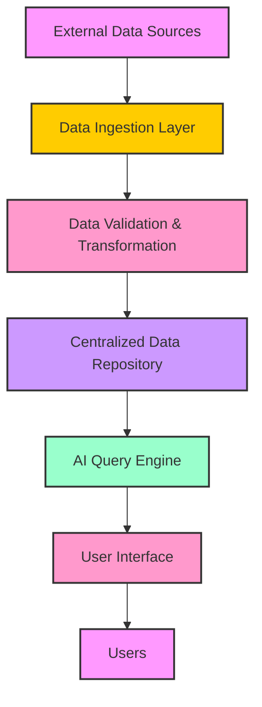

# Data Pipeline Architecture

## Overview
This document outlines the detailed data pipeline architecture for the Financial Intelligence Platform, covering Ingestion, Validation, Storage, and AI Querying.

## Architecture Diagram

## Component Details

### 1. External Data Sources
- **ERP Systems**: SAP S/4HANA (Source of Truth)
- **Legacy Databases**: MySQL (Historical Data)
- **Flat Files**: CSV/Excel uploads via Data Hub

### 2. Data Ingestion Layer (`functions/8-data-ingestion`)
- **API Endpoints**: `POST /ingest_data`
- **File Upload UI**: Data Hub Ingestion Zone (React + Dropzone)
- **Scheduled Jobs**: Airflow (Planned for Phase 10)

### 3. Data Validation & Transformation
- **Pandas ETL**:
    - Schema Validation (Required Columns)
    - Currency Normalization (USD/EUR -> GEL)
    - Date Parsing (ISO 8601)
- **Quality Engine**:
    - Uniqueness Checks
    - Value Range Checks

### 4. Centralized Data Repository
- **Firestore**:
    - `financial_transactions`: Operational Data
    - `registry_datasets`: Metadata Catalog
    - `companies`: Hierarchical Entity Structure

### 5. AI Query Engine (`functions/9-ai-query`)
- **NLP Processor**: Entity Extraction (Company, Date, Metric)
- **Contextual Understanding**: Mapping Intent to Data Sources
- **Answer Generation**: Fact-based response construction

### 6. User Interface
- **Data Hub**: Central Command Console
- **Shell**: Global AI Chat Overlay
- **Prognosis Dashboard**: Scenario Planning
